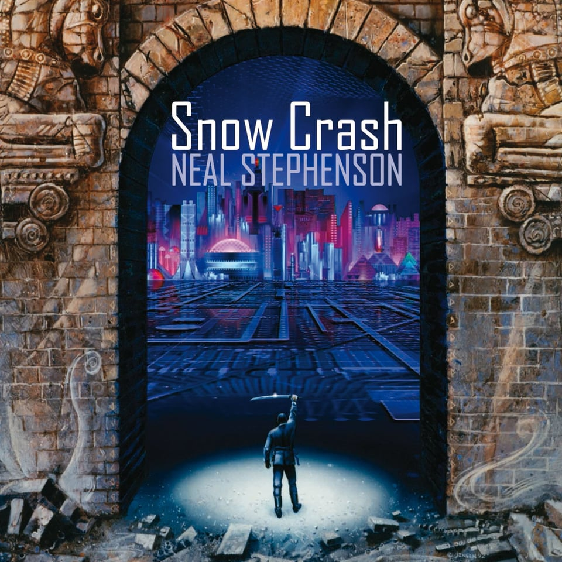

# Project SECURITY - Snow Crash

Welcome to Project SECURITY - Snow Crash! This project serves as an introduction to cybersecurity, providing challenges and tasks to enhance your skills in various fields of cybersecurity. You'll encounter different levels with tasks that require logical thinking and problem-solving.

## Project Structure

The project is divided into multiple levels, each presenting unique challenges. Below is a brief overview of the initial levels:

### Level 00

**Discovery:**
- Located a file named `john` in `/usr/sbin`.

**Decryption:**
- Used [https://www.dcode.fr/caesar-cipher](https://www.dcode.fr/caesar-cipher) to decrypt the code in the `john` file.
- Obtained the decrypted message: `nottoohardhere`.

**Accessing Passwords:**
- Executed `cat /etc/passwd` to discover user information.
- Identified `flag01` with the encrypted password: `42hDRfypTqqnw`.
- Used John The Ripper to decrypt the password: `abcdefg`.

**Wireshark Analysis:**
- Opened a file in the home directory using Wireshark.
- Extracted the password: `ft_wandrNDRelL0L`.

**Exploiting Level 03:**
- Executed `level03`.
- Discovered the message "Exploit me."
- Used `ltrace` to analyze system calls.
- Exploited with the command injection: `http://localhost:4747/?x={`getflag`}`.

**Mail Analysis (Level 05):**
- Checked the mail for `level05` using `cat /var/spool/mail/level05`.
- Found a script scheduled to run every 2 minutes: `su -c "sh /usr/sbin/openarenaserver" - flag05`.

**Exploiting openarenaserver (Level 05):**
- Created a script in `/opt/openarenaserver/` to execute `getflag`.
- Waited for the scheduled script to run.

### Level 06

**Analysis of level06.php:**
- Reviewed the PHP code in `level06.php`.
- Identified the use of the deprecated `/e` modifier in regular expressions.
- Crafted a PHP code that matches the regex and executes `getflag`.
- Used `ltrace` to discover that the code retrieves `LOGNAME` from the environment.
- Exported `Logname` with the value of `getflag` to obtain the flag.

### Level 07

**Analysis of Level 07:**
- Investigated the environment and found a scheduled script in the mail for `level07`.
- The script executes every 2 minutes and runs `/usr/sbin/openarenaserver`.
- Created a script in `/opt/openarenaserver/` to execute `getflag`.
- Waited for the scheduled script to run and retrieved the flag.

### Level 08

**Exploiting Level 08:**
- Analyzed the code using `ltrace` and identified the use of `strstr("token", .. )`.
- Linked the `token` file to another file and read the second one to obtain the flag.
- Executed `ln -s ~/token /tmp/tt`.

### Level 09

**Analysis of Level 09:**
- Understood that the program increments each character in the input by its order.
- Created a script to decrement the input and read the `token`.
- Used `access()` to check authorization before opening a file, and exploited it.
- Created a tmp file, linked it with `token`, and read the flag.

### Level 10

**Exploiting Level 10:**
- The program sends a file to the host, checks permissions using `access()`.
- Created a tmp file, provided it to `access`, and linked it with `token` to read the flag.
- Executed a loop to exploit the file continuously.

### Level 11

**Exploiting Level 11:**
- Examined the LUA code.
- Connected to localhost on port 5151 using `nc`.
- Provided the password "echo `getflag` > /tmp/res" to obtain the flag.

## Getting Started

To begin the project, follow these general instructions:

1. Set up a 64-bit virtual machine (VM) using the provided ISO.
2. Connect to the VM using SSH on port 4242.
3. Explore each level and complete the challenges.

## Notes

- Avoid brute-forcing SSH flags; solutions must be justified.
- Use external software when needed, and set up specific environments.
- Create scripts to streamline tasks and provide explanations during evaluation.
